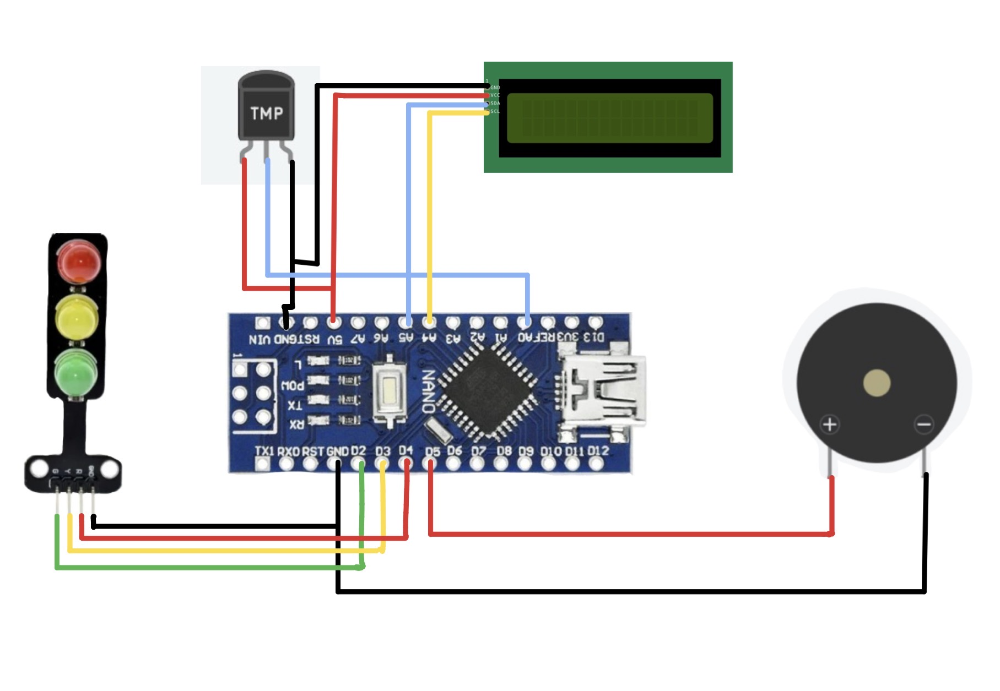
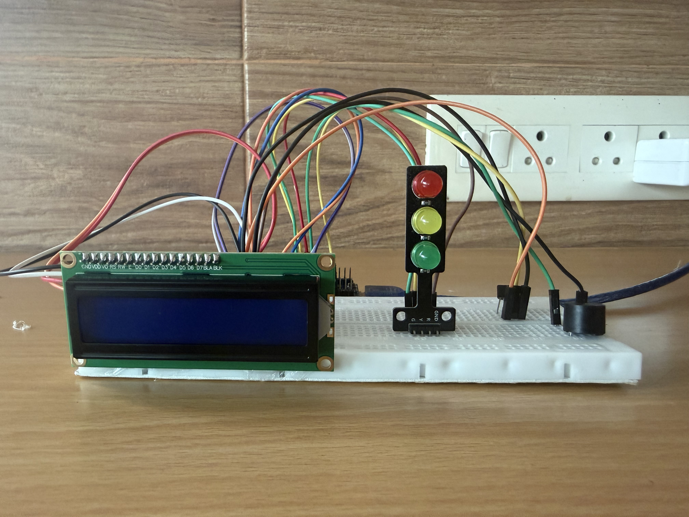

# Digital Thermometer

An Arduino-based digital thermometer that measures temperature using an LM35 sensor and provides real-time LCD display, LED indication, and buzzer alerts.

---

## Table of Contents

- [Project Overview](#project-overview)
- [Features](#features)
- [Components Required](#components-required)
- [Circuit Diagram](#circuit-diagram)
- [Circuit Connections](#circuit-connections)
- [Working Principle](#working-principle)
- [Temperature Thresholds](#temperature-thresholds)
- [Source Code](#source-code)
- [Technologies Used](#technologies-used)
- [Project Gallery](#project-gallery)
- [Demonstration](#demonstration)
- [Applications](#applications)
- [Future Improvements](#future-improvements)
- [Author](#author)
- [License](#license)
- [Acknowledgements](#acknowledgements)

---

# Project Overview

The **Digital Thermometer** is an Arduino Nano-based embedded systems project developed to measure and monitor temperature in real time using the LM35 temperature sensor.

The measured temperature is continuously displayed on a **16×2 LCD with I2C module**. Based on the detected temperature, the system provides visual feedback using a traffic light module and audible warning through a buzzer whenever the temperature exceeds the defined limit.

This project provided practical experience in Arduino programming, analog sensor interfacing, LCD communication using I2C, and embedded systems development.

---

# Features

- Real-time temperature measurement using the LM35 sensor.
- Live temperature display on a 16×2 LCD.
- Automatic temperature status indication.
- Three-level visual indication using a traffic light module.
- Audible warning during high-temperature conditions.
- Serial Monitor output for temperature monitoring.
- Simple, reliable, and low-cost design.

---

# Components Required

| Component | Quantity |
|-----------|:--------:|
| Arduino Nano | 1 |
| LM35 Temperature Sensor | 1 |
| 16×2 LCD with I2C Module | 1 |
| Traffic Light Module | 1 |
| Active/Passive Buzzer | 1 |
| Breadboard | 1 |
| Jumper Wires | As Required |
| USB Cable | 1 |

---

# Circuit Diagram

The circuit was designed and verified before hardware implementation.

---

# Circuit Connections

## LM35 Temperature Sensor

| LM35 Pin | Arduino Nano |
|----------|--------------|
| VCC (Left) | 5V |
| OUT (Middle) | A0 |
| GND (Right) | GND |

---

## LCD with I2C Module

| LCD Pin | Arduino Nano |
|---------|--------------|
| VCC | 5V |
| GND | GND |
| SDA | A4 |
| SCL | A5 |

---

## Traffic Light Module

| Module Pin | Arduino Nano |
|------------|--------------|
| Green | D2 |
| Yellow | D3 |
| Red | D4 |
| GND | GND |

---

## Buzzer

| Buzzer Pin | Arduino Nano |
|------------|--------------|
| Positive (+) | D5 |
| Negative (-) | GND |

---
# Working Principle

The Digital Thermometer continuously measures the surrounding temperature using the LM35 temperature sensor.

The Arduino Nano reads the analog voltage produced by the LM35 sensor and converts it into temperature in degrees Celsius. The measured temperature is displayed on the 16×2 LCD with I2C module while simultaneously determining the current temperature status.

Depending on the measured temperature, the system provides visual indication using the traffic light module and audible warning through the buzzer.

### Cold Zone (<25°C)

- Green LED turns ON.
- LCD displays **Status: COLD**.
- Buzzer remains OFF.
- Indicates that the measured temperature is below the ideal range.

### Ideal Zone (25°C–35°C)

- Yellow LED turns ON.
- LCD displays **Status: IDEAL**.
- Buzzer remains OFF.
- Indicates that the temperature is within the normal operating range.

### Hot Zone (>35°C)

- Red LED turns ON.
- LCD displays **Status: HOT**.
- Buzzer turns ON continuously.
- Warns the user that the temperature has exceeded the predefined limit.

---

# Temperature Thresholds

| Temperature | LCD Status | LED | Buzzer |
|-------------|------------|-----|---------|
| <25°C | COLD | 🟢 Green | OFF |
| 25°C–35°C | IDEAL | 🟡 Yellow | OFF |
| >35°C | HOT | 🔴 Red | ON |

---

# Source Code

The Arduino program reads the analog output of the LM35 temperature sensor, converts it into temperature, displays the measured value on the LCD, and controls the traffic light module and buzzer according to the predefined temperature ranges.

The complete Arduino source code is available in this repository.

---

# Technologies Used

- Arduino Nano
- Arduino IDE
- Embedded C (Arduino Programming)
- LM35 Temperature Sensor
- 16×2 LCD with I2C Module
- Traffic Light Module
- Active/Passive Buzzer

---

# Project Gallery

### Hardware Prototype

---

# Demonstration

Watch the complete project demonstration on YouTube.

🔗 https://youtu.be/B--Wo9cbHi4?si=91ilj3xLKxem6h1K

The demonstration includes:

- Real-time temperature measurement.
- LCD temperature display.
- Automatic temperature status detection.
- LED indication.
- Buzzer alert during high-temperature conditions.
- Complete working of the Digital Thermometer.

---
# Applications

- Home and room temperature monitoring.
- Laboratory temperature measurement.
- Educational Arduino and embedded systems projects.
- Basic environmental monitoring.
- Electronics learning and sensor interfacing demonstrations.
- Temperature monitoring for small prototype systems.

---

# Future Improvements

Possible enhancements include:

- OLED or TFT display for improved visualization.
- Battery-powered portable version.
- Bluetooth or Wi-Fi connectivity for remote monitoring.
- Data logging using an SD card module.
- Real-time clock (RTC) integration for temperature history.
- Mobile application for live temperature monitoring.
- Adjustable temperature threshold settings.
- IoT integration for cloud-based monitoring and notifications.

---

# Author

## Pragathi Muthuvel

**B.Tech – Electronics and Communication Engineering**

**Specialization:** Semiconductor and VLSI Design

This project was developed individually to strengthen practical skills in embedded systems, Arduino programming, sensor interfacing, and LCD communication using the I2C protocol.

---

# License

This project is licensed under the MIT License.

---

# Acknowledgements

I would like to thank the Arduino community and the open-source hardware community for providing valuable learning resources that supported the development of this project.

I also appreciate everyone who encouraged and supported me throughout the completion of this project.

---

---

⭐ Thank you for visiting this repository!